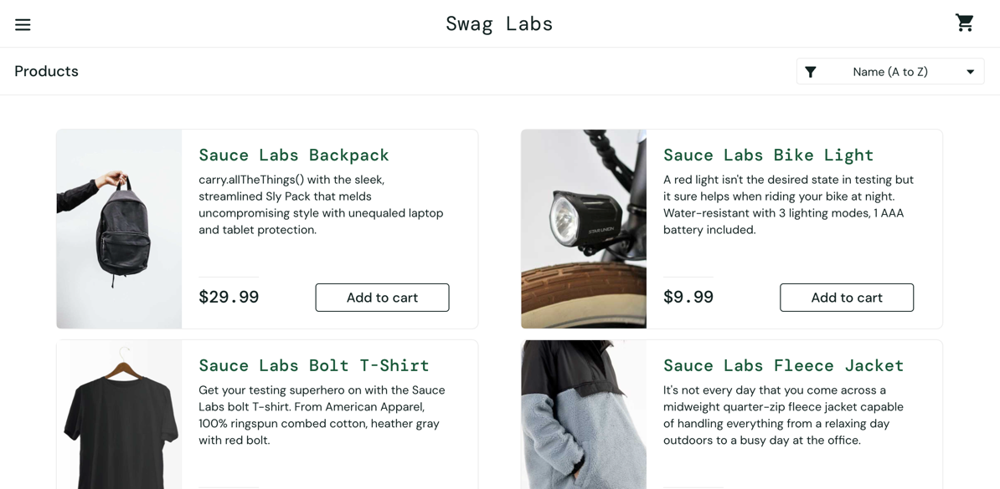

## Automated tests for demo site [Swag Labs](https://www.saucedemo.com/) – Swag Labs

<p>
  
</p>

## Content

- [Stack of technologies](#-stack-of-technologies)
- [Description](#-description)
- [List of UI tests](#-list-of-ui-tests)
- [Executing tests through the command line](#-executing-tests-through-the-command-line)
- [Property files](#-property-files)
- [Running tests in Jenkins](#-running-tests-in-jenkins)
- [Test results report in Allure Report](#-test-results-report-in-allure-report)
- [Integration with Allure TestOps](#-integration-with-allure-testops)
- [Integration with Jira](#-integration-with-jira)
- [Integration with Telegram](#-telegram-notifications-using-a-bot)
- [Video of running tests](#-test-running-example-in-selenoid)

## Stack of technologies

<div style="text-align: center;">


</div>

## Description

This test project consists of UI tests and includes the following features:

- ✔️ **Page Object Design Pattern**: Employing the `Page Object` pattern for enhanced test organization and ongoing maintenance
- ✔️ **Comprehensive Test Reporting and Analytics**: Integration with `Allure TestOps` for robust test reporting and 
in-depth analytical insights
- ✔️ **Test Data Generation**: Utilizing the `Faker` library to generate realistic and randomized test data inputs
- ✔️ **Flexible Parameterization**: Enabling `parameterized builds` to simplify the configuration and customization of test runs
- ✔️ **Configuration files**: Supplies configuration property files for `local`, `remote` and `authentication` settings,
ensuring smooth test execution across various environments
- ✔️ **Efficient Configuration Management**: Leveraging the `Owner` library to manage application configurations via 
Java properties files, ensuring adaptability and streamlined configuration management

## List of UI Tests

//to do

## Executing tests through the command line

To run tests through the command line using Gradle, you can use the following commands:

```bash
gradle clean test -Denv='local'
```

When using the `local` environment, the tests will be executed locally on your machine.

```bash
gradle clean test -Denv='remote'
```

When using the `remote` environment, the tests will be executed remotely using Selenide.

You can pass system properties to your tests during Gradle execution by utilizing the `-D` flag, followed by the 
property name (`env` in this instance) and its associated value (`local` or `remote`). Subsequently, the tests can 
access these properties to customize their execution behavior according to the designated environment.

## Property files

Possible properties in `${env}.properties` file:

```properties
browserWithVersion=
baseUrl=
browserSize=
remoteDriverUrl=
```

> - *remoteDriverUrl* - URL for remote WebDriver (Selenoid)
>- *baseUrl* - base URL for UI tests
>- *browserWithVersion* - browser and its version
>- *browserSize* - size of browser

Possible properties in `auth.properties` file:

```properties
usernameSelenoid=
passwordSelenoid=
```

You must customize the `auth.properties` files locally to align them with your credentials for remote Selenoid access.