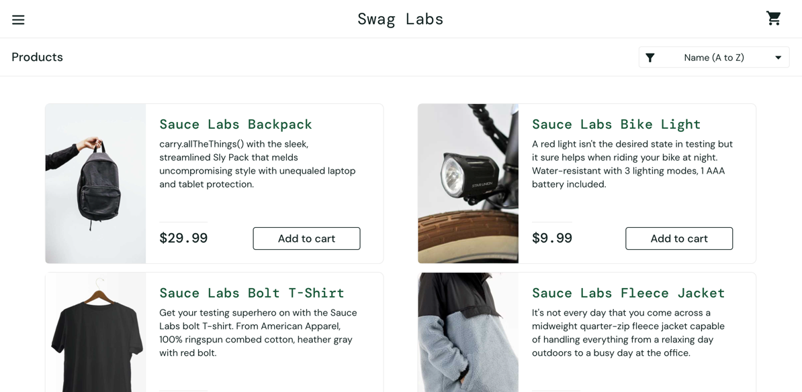
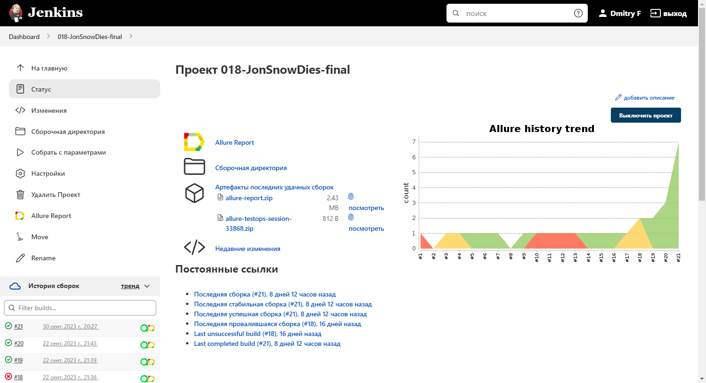
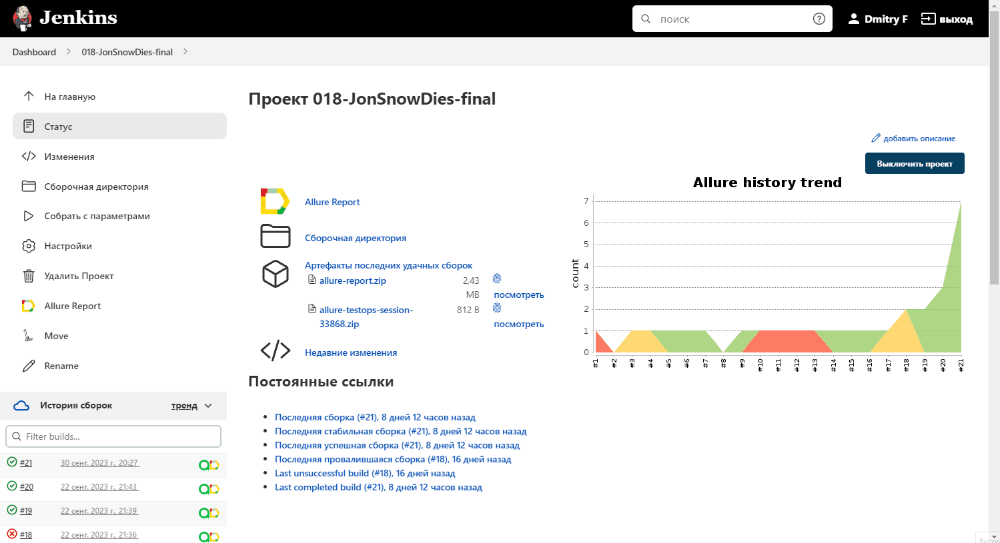
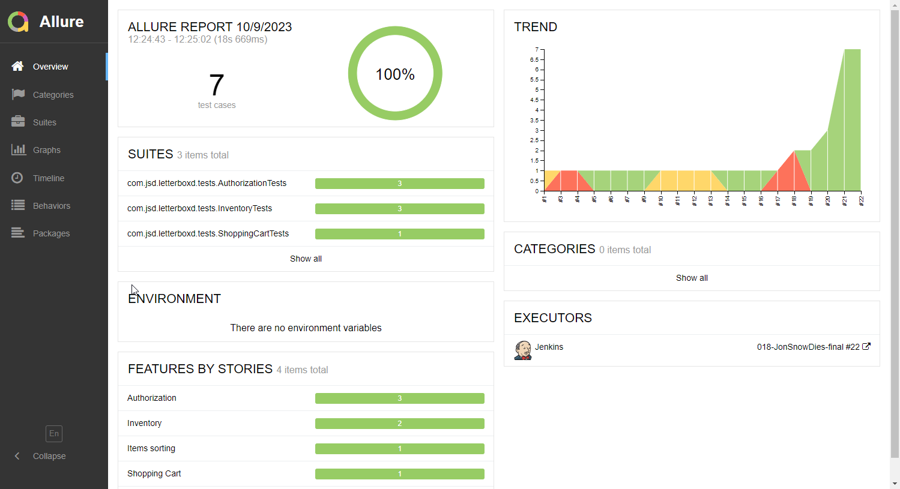
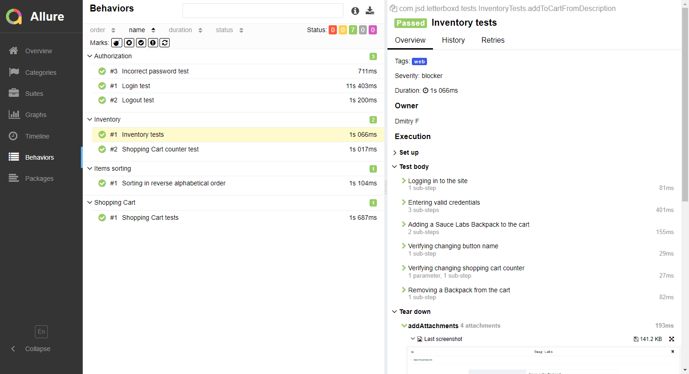
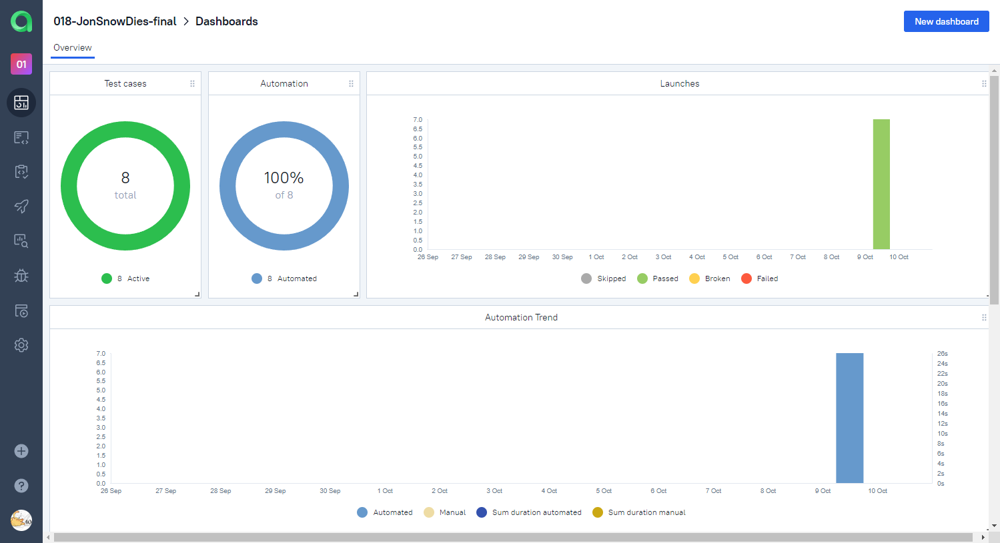
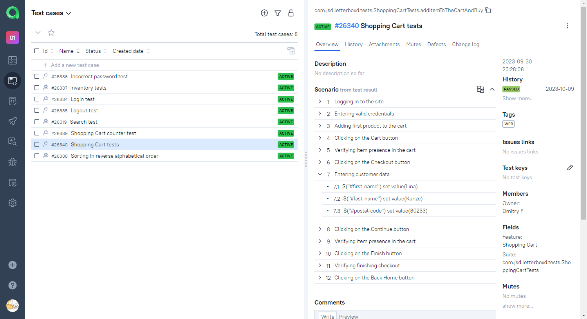
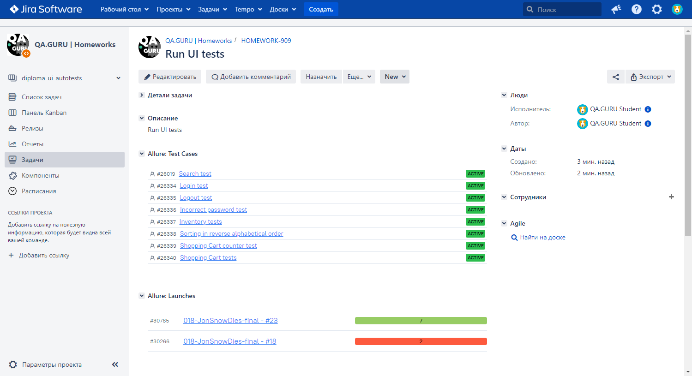
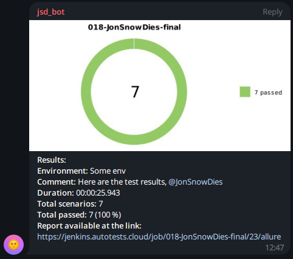
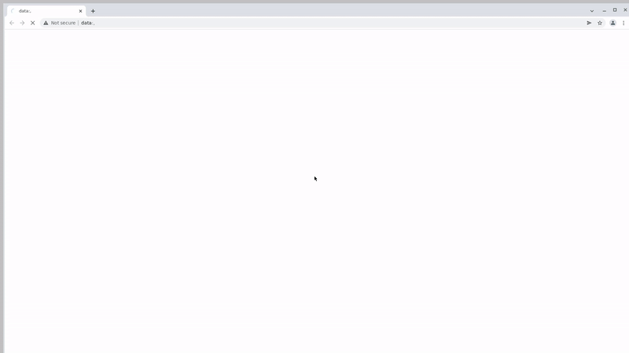

## Automated tests for demo site [Swag Labs](https://www.saucedemo.com/) – Swag Labs

<p>
  
</p>

## Content

- [Stack of technologies](#stack-of-technologies)
- [Description](#description)
- [List of UI tests](#list-of-ui-tests)
- [Executing tests through the command line](#executing-tests-through-the-command-line)
- [Property files](#property-files)
- [Running tests in Jenkins](#running-tests-in-jenkins)
- [Test results report in Allure Report](#test-results-report-in-allure-report)
- [Allure TestOps integration](#allure-testops-integration)
- [Jira integration](#jira-integration)
- [Telegram notifications](#telegram-notifications)
- [Video example of passing the test in Selenoid](#video-example-of-passing-the-test-in-selenoid)

## Stack of technologies

<div style="text-align: center;">


</div>

## Description

This test project consists of UI tests and includes the following features:

- **Page Object Design Pattern**: Employing the `Page Object` pattern for enhanced test organization and ongoing maintenance
- **Comprehensive Test Reporting and Analytics**: Integration with `Allure TestOps` for robust test reporting and 
in-depth analytical insights
- **Test Data Generation**: Utilizing the `Faker` library to generate realistic and randomized test data inputs
- **Flexible Parameterization**: Enabling `parameterized builds` to simplify the configuration and customization of test runs
- **Configuration files**: Supplies configuration property files for `local`, `remote` and `authentication` settings,
ensuring smooth test execution across various environments
- **Efficient Configuration Management**: Leveraging the `Owner` library to manage application configurations via 
Java properties files, ensuring adaptability and streamlined configuration management

[Back to top](#content)

----
## List of UI Tests

- Login test
- Incorrect password test
- Logout test
- Shopping Cart counter test
- Sorting inventory test
- Shopping Cart test

[Back to top](#content)

----
## Executing tests through the command line

To run tests through the command line using Gradle, you can use the following commands:

```bash
gradle clean test -Denv='local'
```

When using the `local` environment, the tests will be executed locally on your machine.

```bash
gradle clean test -Denv='remote'
```

When using the `remote` environment, the tests will be executed remotely using Selenide.

You can pass system properties to your tests during Gradle execution by utilizing the `-D` flag, followed by the 
property name (`env` in this instance) and its associated value (`local` or `remote`). Subsequently, the tests can 
access these properties to customize their execution behavior according to the designated environment.

[Back to top](#content)

----
## Property files

Possible properties in `${env}.properties` file:

```properties
browserWithVersion=
baseUrl=
browserSize=
selenoid=
```

>- *selenoid* - URL for remote WebDriver (Selenoid)
>- *baseUrl* - base URL for UI tests
>- *browserWithVersion* - browser and its version
>- *browserSize* - size of browser

Possible properties in `auth.properties` file:

```properties
username.selenoid=
password.selenoid=
```

You must customize the `auth.properties` files locally to align them with your credentials for remote Selenoid access.

[Back to top](#content)

----
## Running tests in [Jenkins](https://jenkins.autotests.cloud/job/018-JonSnowDies-final/)

To execute the tests in Jenkins, use the following command:

```bash
gradle clean test "-DbrowserWithVersion=${BROWSER_WITH_VERSION}" -DbaseUrl=${BASE_URL} -DbrowserSize=${BROWSER_SIZE} -DremoteDriverUrl=${SELENOID_URL}
```

This command includes various system properties that are used to configure the test execution in Jenkins:

- `-DbrowserWithVersion=${BROWSER_WITH_VERSION}`: Specifies the browser and its version to be used for the test
  execution.
- `-DbaseUrl=${BASE_URL}`: Sets the base URL for the application under test.
- `-DbrowserSize=${BROWSER_SIZE}`: Defines the browser window size.
- `-Dselenoid=${selenoidUrl}`: Specifies the URL of the remote WebDriver, such as Selenium Grid or Selenoid.

Make sure to replace `${BROWSER_WITH_VERSION}`, `${BASE_URL}`, `${BROWSER_SIZE}`, and `${selenoidUrl}` with the
appropriate values based on your Jenkins configuration and test requirements.

Main page of the build:

<div style="text-align: center;">
  
</div>

<div style="text-align: center;">
  
</div>

[Back to top](#content)

----
##  Test results report in [Allure Report](https://jenkins.autotests.cloud/job/018-JonSnowDies-final/22/allure)

<code><strong>Allure Report</strong></code> overview page:

<div style="text-align: center;">
  
</div>

<code><strong>Allure Report</strong></code> behavior page:
<div style="text-align: center;">
  
</div>

[Back to top](#content)

----
## [Allure TestOps](https://allure.autotests.cloud/launch/30785) integration

<code><strong>Allure TestOps</strong></code> dashboard page:
<div style="text-align: center;">
  
</div>

<code><strong>Allure TestOps</strong></code> test cases page:
<div style="text-align: center;">
  
</div>

[Back to top](#content)

----
## [Jira](https://jira.autotests.cloud/browse/HOMEWORK-909) integration

<div style="text-align: center;">
  
</div>

[Back to top](#content)

----
## Telegram notifications

After passing the tests, a report can be sent to <code>Telegram</code> messenger.

<div style="text-align: center;">
    
</div>

[Back to top](#content)

----
## Video example of passing the test in Selenoid

Each test in the Allure Report has a video attached.

<div style="text-align: center;">
  
</div>

[Back to top](#content)